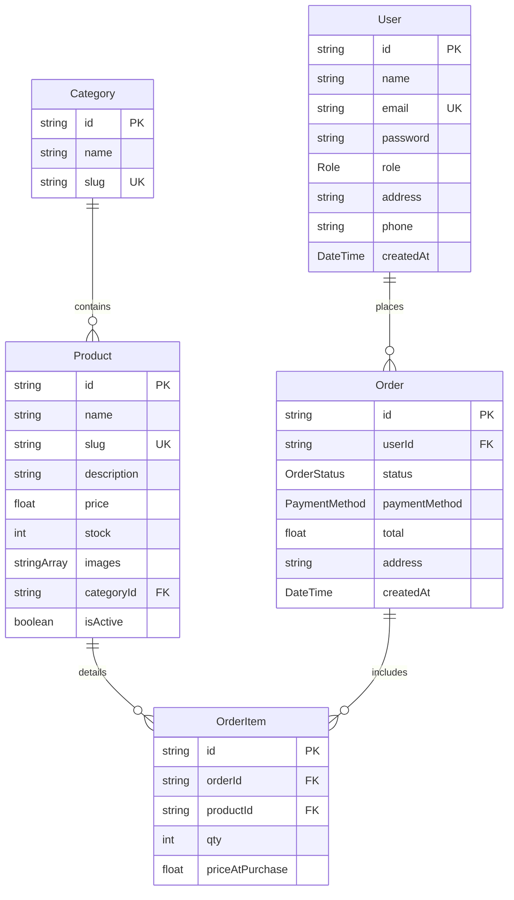

# Module 2: Neon PostgreSQL DB & Prisma ORM Schema

We have successfully configured the database layer of the E-Shop! The architecture integrates **Neon Serverless PostgreSQL** with **Prisma 7** using highly-performant, edge-compatible database adapters.

---

## 💽 Database Architecture Decisions

1. **Neon Serverless PostgreSQL**: 
   - Scales connections dynamically, preventing serverless execution limits.
   - Computes scale-to-zero during inactivity, saving resources.
   - Operates natively inside Vercel's edge or serverless deployment wrappers.
2. **Prisma 7 ORM**:
   - Delivers compile-time type-safety for queries.
   - Decouples database schema logic from environment variables.
   - Leverages **Driver Adapters** for runtime database communication (crucial for stateless/edge environments).

---

## 💡 Code Mechanics & Tool Explanations

### 1. Prisma 7 Configuration Model (`prisma.config.ts`)
In Prisma 7, connection URLs (`url`) are no longer permitted within the `datasource` block of `schema.prisma`. This divides static modeling from environment-specific targets.
- **How it works**: A centralized `prisma.config.ts` loads environment parameters (`dotenv/config`) and maps the runtime `DATABASE_URL` dynamically for migrate or introspect events:
  ```typescript
  import "dotenv/config";
  import { defineConfig, env } from "prisma/config";

  export default defineConfig({
    schema: "prisma/schema.prisma",
    datasource: { url: env("DATABASE_URL") }
  });
  ```

### 2. Client Singleton with Neon Driver Adapters (`lib/prisma.ts`)
Prisma 7 requires driver adapters for direct runtime connections. 
- **How it works**: We initialize `@prisma/adapter-neon` combined with Neon's serverless package `@neondatabase/serverless`.
- **WebSocket Constructor Binding**: For Node.js server runtimes, we map `neonConfig.webSocketConstructor = ws`, enabling safe queries over WebSockets.
- **Next.js Connection Reuse**: During development hot-reloads, Next.js routinely clears cache modules. We bind our `PrismaClient` reference to a `globalThis` property to prevent multiple active connection pools that would otherwise crash the database.

---

## 🗂️ Relational Database Schema Schema (`prisma/schema.prisma`)

We modeled **5 core relational tables** using strict Postgres constraints:



### Table Definitions & Logic:
- **`User`**: Handles authorization. It supports role differentiation (`ADMIN` | `CUSTOMER`). The password is nullable to allow Google OAuth alongside credentials.
- **`Category`**: Catalog subdivisions (e.g. "Electronics") with unique URL-friendly slugs.
- **`Product`**: Holds listings. Features active indicators (`isActive`), custom stocks (`stock`), and support for multiple Cloudinary CDN image references (`images String[]`).
- **`Order`**: Transaction metadata detailing fulfillment status (`OrderStatus` enums: `PENDING`, `PAID`, `SHIPPED`, etc.) and total costs.
- **`OrderItem`**: Represents detailed invoice lines. It captures the static price (`priceAtPurchase`) at the moment of checkout, shielding order history from future catalog price shifts.

---

## 🌱 Database Seeding (`prisma/seed.ts`)

A seeding script clears target database tables in correct relational order and inserts baseline mock data:
- **Users**: Admin (`admin@eshop.com`) and Customer (`john@example.com`).
- **Categories**: Electronics, Accessories, and Lifestyle.
- **Products**: Solitude Glass Chronograph, Frosted Cybernetic Headphones, Indigo Glassmorphic Keycaps, Minimalist Leather Cardholder.

### Client Integration:
To ensure the seeding script runs correctly in both serverless and local environments, it imports our custom client singleton `lib/prisma` (instead of raw `@prisma/client`). This guarantees WebSocket support (`ws`) and proper environment variables loading automatically at runtime.

### Prisma 7 Configuration:
In Prisma 7, seeding configurations are declared inside the `migrations` block of `prisma.config.ts` instead of the legacy `package.json` file. We mapped this as follows:
```typescript
migrations: {
  seed: "npx tsx prisma/seed.ts",
}
```

### How to Run:
Ensure `.env` contains your actual Neon `DATABASE_URL`, then execute the standard Prisma database seeder:
```bash
npx prisma db seed
```

---

## 🔧 Operational CLI Reference

- **`npx prisma validate`**: Runs schema validation checks.
- **`npx prisma format`**: Formats the schema file structure.
- **`npx prisma generate`**: Compiles Prisma Client and updates typescript declarations.
- **`npx prisma db push`**: Synchronizes the schema model directly to your remote Neon PostgreSQL database without creating migrations. Useful for development and prototyping.
